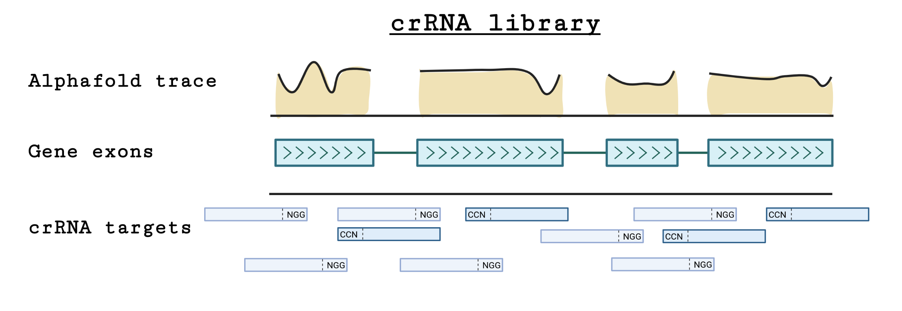

# crRNA library (2021)
Repository containing scripts and the pipeline followed to select a collection of *C. elegans* CRISPR RNAs (crRNAs) targets with multiple purposes.

## Basic gist
The main use of this repository is to produce collections of *C. elegans* crRNAs for a given use, *e.g.* N or C-terminus tagging, considering their possible off-target sequences, cutting efficiency, location within a gene, and possible cut between protein domains (as predicted by [Alphafold Protein Structure Database](https://alphafold.ebi.ac.uk/)) as illustrated in the following diagram and section.

This repository contains only the scripts for the selection while its usage is described elsewhere, for example, in the [crRNA library track selection app](https://github.com/AmhedVargas/CRISPR_library_track).

## Considerations
### crRNA selection
All possible *C. elegans* crRNA target sequences were scrutinized, filtered, and assigned to at least one of the following categories:

**1. ATG_500:** crRNAs targeting the 500bp upstream region of a genebody with homology arms next to the expected cut site.
    
**2. ATG_250:** crRNAs targeting the 250bp upstream region of a genebody with homology arms around the expected cut site.
    
**3. ATG:** crRNAs targeting the ATG of each isoform in around a 10bp window with homology arms starting after the start codon (in frame).

**4. CDS:** crRNAs targeting each possible CDS of a given gene. For CDS predicted to encode for a stable protein domain with high confidence, i.e. Alphafold's pLDTT median score above 90, we prioritize the selection of crRNA with the lowest pLDTT score in its cutting site. With this criteria we hoped to avoid disruption of sensitive regions for protein activity, however, note that studies in *drosophila* have revealed that efficient internal protein fluorescent tagging can occur irrespective of the insertion site (*e.g.* [Nagarkar-Jaiswal *et. al.* 2015](https://elifesciences.org/articles/5338)).

**4a. CDS guidescan:** crRNAs obtained from the program guidescan. We prioritized these ones as scores for cutting efficiency and on-site activity were available. Note that we obtained these scores by running a [docker container](https://hub.docker.com/layers/xerez/guidescan/latest/images/sha256-ea5c5ed0b873205243babb26a49f85f14f2c05fd992e66f6ff13722842df9ef7) with its software pre-installed and querying all possible sites across the *C. elegans* genome.
    
**4b. CDS hamming:** For genes with no unique crRNA site (*i.e.* 0 off-targets) such as recent gene duplications, we selected crRNAs with low off-targets as calculated by the hamming distance (*i.e.* a metric that calculate similarity of sequences by determining how many base substitutions are required to go from one to the another) to other sites to the genome. 
    
**5. Stop:** crRNAs targeting the end of a genebody with homology arms adjacent to the beginning of the stop codo.n
    
**6. lincRNA:** crRNAs targeting long no coding RNAs.
    
**7. miRNAs:** crRNAs targeting microRNA sites.

Please note that for genes with multiple start or stop sites, we also tried to select corresponding crRNAs (*i.e.* ATG_500, ATG_250, ATG, and Stop).

Then for each crRNA in the selection, adjacent sequences were added and treated as homology arms for CRISPR experiments. In these arms, restriction sites as re-appearing crRNA sites were removed by altering their sequences (with synonym mutations if located in coding regions).

### Ordering schema within plates
The crRNA library was designed to be compused of **four** 384 plates each of them with 120 oligos. Read Al-johadni et al. for further information. The final arrangement of our plates had the following considerations:
    
    * Last well of each plate (384) contains sequences used as co-CRISPR.
    
    * On plate 4, well 379 to 382 contains a set of selected crRNAs on genes that are used as controls.
    
    * Well 383 is a duplication of co-CRIPSR oligos, and so well 383 and 384 are the same for plate 4.

## Library generation

